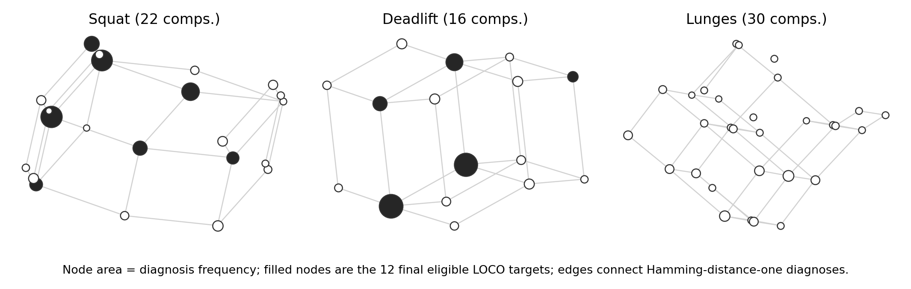
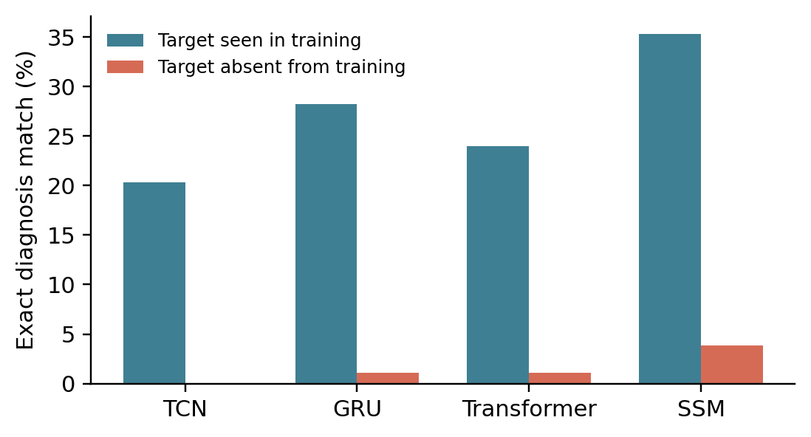

# Beyond Seen Mistakes

**A matched test of natural error-composition generalization in exercise assessment**

[](https://github.com/AbdelrahmanAboegela/beyond-seen-mistakes/actions/workflows/ci.yml)
[](https://www.python.org/)
[](LICENSE)
[](paper/Beyond_Seen_Mistakes.pdf)

## In plain terms

Picture an app that watches you do a squat and grades several things at once: foot
angle, hip position, back posture, how deep you went. Each of those is graded
correctly most of the time on its own. The question this project asks is narrower
and easy to miss: **what happens when a specific combination of mistakes shows up
that the model never saw during training, even though it has seen every individual
mistake in that combination separately?**

We built a controlled test for exactly that blind spot, using a public exercise-pose
dataset (ALEX-GYM-1). The short version of what we found:

- **Yes, it breaks.** Hide one naturally occurring combination of mistakes from
  training, keep everything else (test videos, training budget, model init) exactly
  the same, and exact-match accuracy on that combination collapses from 22.65% to
  1.52%. This happens across four different model families, so it isn't one
  architecture's quirk.
- **A fancier explanation for *which* combinations break doesn't hold up.** We
  tested whether a mistake fails because training examples with a similar *context*
  tend to disagree with it (a "local" explanation). It doesn't — once you control for
  plain old class imbalance (how rare that mistake's state is in training, full
  stop), the local/contextual effect adds nothing.
- **That plain imbalance count is still useful, though.** Because it only needs
  training labels — no model, no training run — you can compute it for a proposed
  diagnosis combination *before* spending compute on it, as a quick red flag for
  "this combination is under-supported and likely to be misdiagnosed."

If you're here for the code and data, skip to [Quick start](#quick-start). If
you're here for the paper, it's [`paper/Beyond_Seen_Mistakes.pdf`](paper/Beyond_Seen_Mistakes.pdf).



Each node is a naturally observed multi-error diagnosis, node area is frequency, and
edges connect diagnoses that differ in one criterion. Filled nodes are the 12
supported targets withheld one at a time. Every individual criterion state remains
represented in training; the combination does not.

## Why it matters

If you're building or evaluating an automated feedback system for exercise form (or
any multi-label system that reports several judgments per input), ordinary
train/test splits can hide this failure. A model can score well on a held-out set
and still be unreliable the moment a real user produces an unusual *combination* of
correct and incorrect form cues, because grouped accuracy averages over combinations
rather than testing any one of them directly. This repository gives you (a) a
protocol to check for that specific failure on your own data, and (b) a free,
training-free statistic to flag which planned combinations are most at risk before
you ever train a model.

## Main findings

| Question | Result | Interpretation |
|---|---:|---|
| **RQ1.** Does removing a diagnosis from matched training reduce performance on the same test recordings? | Optimized exchange exact match: **22.65% → 1.52%**, gap 21.13 pp, 95% CI [9.86, 34.73], *p*=.00049 | Yes, across TCN, GRU, Transformer and SSM. |
| Secondary criterion outcome | Bit accuracy drops **12.80 pp**, CI [7.38, 18.79], *p*=.00049 | The failure is not only an exact-match artifact. |
| **RQ2.** Does local label opposition add information beyond marginal support? | Raw LOP ρ=-.632; global support ρ=-.742; partial LOP *p*=.200 | LOP adds nothing once marginal support is controlled for. Marginal support (`global_opposing_support`, $G_c$) is ordinary class imbalance, not a new statistic — but confirming it dominates the fancier local explanation is itself the useful, actionable finding: bottom-quartile criteria average 82.70% held-out accuracy vs. 40.79% for top-quartile criteria. |

**Replicated on a second dataset.** The whole protocol was repeated on [CPR-Coach](https://github.com/Shunli-Wang/CPR-Coach) (13 error types, naturally co-occurring composites). Across **72 eligible compositions** the gap is **11.80 pp, 95% CI [9.03, 14.77]** — inside the ALEX-GYM-1 interval but ~6x more precisely bounded, and no longer pinned to the test's own floor (exact p=7.4e-18 against a floor of 5.4e-20). RQ2's negative result replicates more decisively too: LOP's partial association is −.005 (p=.87) over 936 units. See [`results/cpr_rq_stats.json`](results/cpr_rq_stats.json).

**A preprocessing defect the second dataset exposed.** Resampling every repetition to a fixed 16 frames normalises away the quantity that *rate-defined* criteria measure. On CPR-Coach the four rate criteria scored **14.50 pp below their own trivial baselines** — worse than guessing. Restoring duration, speed and cadence recovers them (+17.73 pp lift; posture +0.67, hand −0.56) and lifts exact match from 15.72% to 37.47%. On ALEX-GYM-1 the same channels change nothing, because its criteria are largely geometric — so the defect tracks what a criterion *measures*, not which corpus it came from.

The contribution is the **matched observed-composition protocol and controlled
effect**, plus confirmation that $G_c$ (ordinary training-label imbalance) — not a
new statistic — predicts which criteria will fail, so it doubles as a free
pre-training audit. This is **not** a claim that FACT (the comparator architecture
included here) is universally superior, and **not** a claim of a novel diagnostic
tool — see the [glossary](#glossary) and the paper's Related Work section for how
this connects to prior work on class imbalance and compositional generalization.
The negative LOP result is deliberately reported anyway: it redirects the
diagnostic from a fancier mechanism story to the simpler, actionable one.



Left: each line is one of the 12 held-out diagnoses, with exact match when its composition is present in training versus absent. All 12 fall. Right: the same per-target gaps plotted against the residual criterion-marginal mismatch the exchange optimization could not remove — the largest gaps occur at the *smallest* residual mismatch (ρ=-.26), which is the opposite of what you would see if leftover imbalance, rather than the missing composition, were driving the effect. The paper draws this figure natively in LaTeX; this PNG is the same data rendered for the README.

## Glossary

Plain-language definitions, for readers who aren't already fluent in this
subfield's shorthand.

| Term | Meaning |
|---|---|
| **Diagnosis / criterion** | A "criterion" is one gradable aspect of a repetition (e.g. foot angle). A "diagnosis" is the full set of pass/fail judgments across every criterion for one repetition — a vector of bits, one per criterion. |
| **Composition / combination** | Which criteria are wrong *together* in one diagnosis. The same individual mistakes can appear in many different combinations. |
| **Recording-pair-disjoint** | No frontal/lateral video pair used for training or validation is also used for testing. This blocks the model from having literally seen the test footage, but on its own it does *not* guarantee the test's diagnosis combination was ever seen in training — that's a separate, stronger condition this project tests for directly. |
| **LOCO (leave-one-composition-out)** | The core test: pick one naturally occurring diagnosis combination, remove every recording that produced it from training, then see how the model does on exactly that combination. |
| **Matched present/absent test** | A stricter version of LOCO: instead of just comparing to an ordinary validation set, we build two training sets — one with the target combination, one without — that are otherwise identical in size, class weights, and initialization, and compare the same held-out test recordings under both. This holds the obvious alternative explanations fixed — it does *not* fully isolate the effect, because the exchanged rows cannot have identical criterion marginals, which is why the paper reports an association rather than a causal effect. |
| **Exact match** | The strictest accuracy metric: every criterion in a repetition must be judged correctly for it to count. |
| **Bit accuracy** | A softer metric: the fraction of individual criterion judgments (not whole diagnoses) that are correct. |
| **LOP (Label-Opposition Pressure)** | A statistic testing whether a criterion fails because many training examples *with a similar context* (same other criteria) support the opposite judgment. A "local," context-aware explanation. |
| **$G_c$ (global opposing support)** | A much simpler statistic: just count how many training examples have the *opposite* state for this one criterion, ignoring context entirely. This is ordinary class imbalance. It turns out to predict failure better than LOP, and — unlike LOP — needs no model to compute. |
| **FACT** | Factorized Anatomical Criterion Tokens: one of six models compared here. It routes each criterion to the camera view and joints an annotator would use to judge it. Included as a locality-motivated comparator, not presented as the paper's main contribution. |

## Protocol in one minute

For each naturally observed diagnosis vector `y*`:

1. Put every repetition with `y = y*` in the test fold.
2. Remove the complete paired-recording group of each test repetition from training and validation.
3. Split the remaining groups deterministically, accepting a fold only when both states of every criterion have ≥8 training examples and ≥1 validation example.
4. For the matched test, keep validation/test rows, initialization, class weights and training size identical; exchange target-diagnosis rows for the same number of non-target rows.
5. Select exchanged rows with a deterministic binary optimization: minimize the worst criterion-positive count mismatch, then the total mismatch. Exact equality is impossible because every non-target row differs from the target in at least one bit.

This optimization reduces the fold-mean worst mismatch from 22.06 to 10.89 counts and total mismatch from 55.08 to 33.42. Residual imbalance remains, so the result supports a robust association—not a causal interpretation. The earlier random-exchange estimate (25.44 pp exact-match gap) is retained as a compatibility check.

The final protocol has 7 squat and 5 deadlift targets. Lunge remains in the data audit but has no target that satisfies the frozen support rule. The grouping identifier pairs frontal and lateral recordings; it is **not a verified participant ID**.

## Models and what the numbers mean

All models receive the same two-view, 16-frame, 33-joint 3D pose input and independent binary criterion targets.

| Model | Role |
|---|---|
| TCN | Dilated temporal convolution baseline |
| GRU | Recurrent temporal baseline |
| Transformer | Self-attention temporal baseline |
| SSM | Lightweight state-space temporal baseline |
| ST-GCN | Two-view spatial graph/temporal convolution baseline |
| FACT | Factorized Anatomical Criterion Tokens |

**FACT** routes each criterion to its annotation-aligned camera view and a soft prior over relevant joints. A temporal encoder pools mean and maximum evidence, a criterion-specific adapter creates a 32-D token, and the token is decoded by a local linear head plus a learned two-state prototype distance. FACT never consumes other ground-truth labels at inference.

Metric definitions are in the [glossary](#glossary) above.

## Repository map

```text
configs/          frozen LOCO, random-v2, and optimized-v3 split manifests
data/             setup instructions only; dataset is not redistributed
paper/            submission PDF, LaTeX source, and figures
results/runs/     original 180 per-run JSON records
results/matched_composition_v2/ 144 paired matched-test records
results/matched_composition_v3_optimized/ 144 optimized-exchange records and balance audit
results/stgcn_loco/ 36 graph-baseline stress-test records
results/context/  aggregated metrics and LOP analysis
results/data_audit/ provenance and missing-pose audit
results/supplementary/ inconclusive LMR experiment
scripts/          figure generation and artifact verification
src/              data loader, splits, models, training, and statistics
```

## Quick start

```bash
python -m venv .venv
# Linux/macOS: source .venv/bin/activate
# PowerShell:   .venv\Scripts\Activate.ps1
pip install -r requirements.txt
python scripts/verify_release.py
```

No dataset or GPU is needed to reproduce the reported statistics and plots:

```bash
python src/aggregate_runs.py
python src/analyze_lop_controls.py
python src/analyze_matched_composition.py --runs 'results/matched_composition_v3_optimized/runs/*.json' --outdir results/matched_composition_v3_optimized
python src/compose_final_results.py
python scripts/generate_figures.py
```

To retrain, obtain ALEX-GYM-1 and follow [`data/README.md`](data/README.md), then run:

```bash
python src/run_context_evidence_sweep.py \
  --models tcn,gru,transformer,ssm,fact \
  --outdir results/reproduction
```

The two new controlled additions are reproduced with:

```bash
python src/run_matched_sweep.py --models tcn,gru,transformer,ssm \
  --manifest configs/matched_manifest_v2.json \
  --outdir results/matched_composition_v3_optimized
python src/run_context_evidence_sweep.py --models stgcn --outdir results/stgcn_loco
```

This is the fixed reported budget, not an open-ended sweep. See [`REPRODUCIBILITY.md`](REPRODUCIBILITY.md) for the full protocol and [`RESULTS.md`](RESULTS.md) for the audited estimates.

## FAQ

**Is FACT the point of this paper?**
No. FACT is one of six models used to stress-test whether the composition failure
survives a locality-aware, anatomically-informed architecture. It does not; FACT
fails on held-out combinations too. Nothing here claims FACT (or any model) fixes
the problem.

**Should I use $G_c$ instead of collecting more data?**
No — $G_c$ tells you *where* your training data is thin for a planned diagnosis
combination. It's a checklist item, not a fix. The natural response to a low $G_c$
is to gather more examples of that criterion's minority state, or to flag
predictions on that combination as lower-confidence.

**Can I run this protocol on my own multi-label dataset?**
The split logic (`src/loco_split.py`) and the matched present/absent construction
are dataset-agnostic as long as your data has (a) a group identifier that should
never straddle train/val/test, and (b) a multi-bit diagnosis label per example.
You would need to write your own loader in place of `src/alexgym_data.py`.

**Do I need a GPU?**
No, for reproducing the reported statistics and figures from the released result
records (see Quick start above). Retraining from raw pose data benefits from one,
but every model here is small (13k–190k parameters) and was trained on commodity
hardware.

## Scope and limitations

- ALEX-GYM-1 is the only dataset used; external composition replication remains future work.
- The split is recording-pair-disjoint, not verified participant-disjoint.
- Whole missing frames are interpolated. One fully missing-view squat sample is excluded and logged.
- Ordinary grouped validation already contains some unseen label sets, so RQ1 compares it with a **targeted** composition stress test rather than a pure IID-versus-OOD contrast.
- Neither FACT nor ST-GCN eliminates the shift; architecture design is not the paper's primary novelty.

## Paper and citation

The anonymous submission snapshot is [`paper/Beyond_Seen_Mistakes.pdf`](paper/Beyond_Seen_Mistakes.pdf). Citation metadata intentionally remains anonymous during double-blind review and will be updated after the decision.

Code is released under the [MIT License](LICENSE). ALEX-GYM-1 is governed by its original authors' terms and is not included. Paper text and artwork are not relicensed by the software license.
