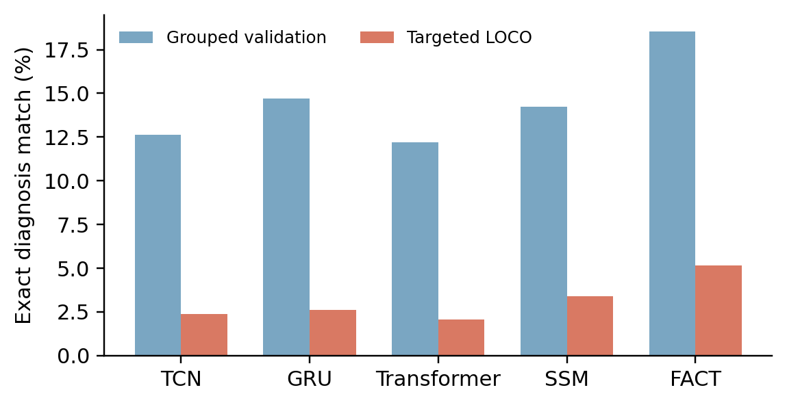

# Beyond Seen Mistakes

**Diagnosing natural error-composition shift in multi-criterion exercise assessment**

[](https://github.com/AbdelrahmanAboegela/beyond-seen-mistakes/actions/workflows/ci.yml)
[](https://www.python.org/)
[](LICENSE)
[](paper/Beyond_Seen_Mistakes.pdf)

Exercise-assessment models can recognize individual error criteria yet fail when familiar errors appear in a diagnosis combination withheld from training. This repository provides a frozen, recording-pair-disjoint stress test for that failure mode, five matched temporal models, the FACT architecture, audited result records, and the source of the JAC-ECC 2026 HAR–EAS submission.


Each node is a naturally observed multi-error diagnosis, node area is frequency, and edges connect diagnoses that differ in one criterion. Filled nodes are the 12 supported targets withheld one at a time. Every individual criterion state remains represented in training; the combination does not.

## Main findings

| Question | Result | Interpretation |
|---|---:|---|
| **RQ1.** Does targeted composition holdout expose a gap hidden by ordinary grouped validation? | Exact match drops **11.34 pp**, 95% CI [8.09, 14.54], Holm *p*=.00098 | Yes, across the five-model panel. |
| **RQ2.** Can training-label structure anticipate criterion failures? | Mean within-diagnosis Spearman **ρ=-.651**, blocked-permutation Holm *p*<.00012 | Higher label-opposition pressure predicts lower target-bit accuracy. |
| Supplemental: does label-mismatch risk improve failure ranking? | +4.99 AUPRC points, CI [-0.15, 10.26], *p*=.092 | Not supported overall; retained to avoid selective reporting. |

The contribution is the **observed-composition protocol and label-opposition diagnostic**, not a claim that FACT is universally superior. The negative supplemental result is deliberately public.



## Protocol in one minute

For each naturally observed diagnosis vector `y*`:

1. Put every repetition with `y = y*` in the test fold.
2. Remove the complete paired-recording group of each test repetition from training and validation.
3. Split the remaining groups deterministically, accepting a fold only when both states of every criterion have ≥8 training examples and ≥1 validation example.
4. Train without test-fold tuning and evaluate the held-out diagnosis.

The final protocol has 7 squat and 5 deadlift targets. Lunge remains in the data audit but has no target that satisfies the frozen support rule. The grouping identifier pairs frontal and lateral recordings; it is **not a verified participant ID**.

## Models and what the numbers mean

All models receive the same two-view, 16-frame, 33-joint 3D pose input and independent binary criterion targets.

| Model | Role |
|---|---|
| TCN | Dilated temporal convolution baseline |
| GRU | Recurrent temporal baseline |
| Transformer | Self-attention temporal baseline |
| SSM | Lightweight state-space temporal baseline |
| FACT | Factorized Anatomical Criterion Tokens |

**FACT** routes each criterion to its annotation-aligned camera view and a soft prior over relevant joints. A temporal encoder pools mean and maximum evidence, a criterion-specific adapter creates a 32-D token, and the token is decoded by a local linear head plus a learned two-state prototype distance. FACT never consumes other ground-truth labels at inference.

Metrics have distinct meanings:

- **Bit accuracy:** fraction of individual criterion decisions that are correct.
- **Micro-F1:** positive-error detection pooled across criteria.
- **Exact match:** fraction of repetitions for which every criterion is correct; this is the diagnosis-level primary outcome.
- **LOP:** a training-label-only count of one-bit opposing neighbors for a focal criterion. It diagnoses exposure pressure; it is not a causal model explanation.

## Repository map

```text
configs/          frozen protocol and exact split manifest
data/             setup instructions only; dataset is not redistributed
paper/            submission PDF, LaTeX source, and figures
results/runs/     180 per-run JSON records
results/context/  aggregated metrics and LOP analysis
results/data_audit/ provenance and missing-pose audit
results/supplementary/ inconclusive LMR experiment
scripts/          figure generation and artifact verification
src/              data loader, splits, models, training, and statistics
```

## Quick start

```bash
python -m venv .venv
# Linux/macOS: source .venv/bin/activate
# PowerShell:   .venv\Scripts\Activate.ps1
pip install -r requirements.txt
python scripts/verify_release.py
```

No dataset or GPU is needed to reproduce the reported statistics and plots:

```bash
python src/aggregate_runs.py
python src/analyze_research_questions.py
python scripts/generate_figures.py
```

To retrain, obtain ALEX-GYM-1 and follow [`data/README.md`](data/README.md), then run:

```bash
python src/run_context_evidence_sweep.py \
  --models tcn,gru,transformer,ssm,fact \
  --seeds 7,42,123 \
  --outdir results/reproduction
```

This is the fixed reported budget, not an open-ended sweep. See [`REPRODUCIBILITY.md`](REPRODUCIBILITY.md) for the full protocol and [`RESULTS.md`](RESULTS.md) for the audited estimates.

## Scope and limitations

- ALEX-GYM-1 is the only dataset used; external composition replication remains future work.
- The split is recording-pair-disjoint, not verified participant-disjoint.
- Whole missing frames are interpolated. One fully missing-view squat sample is excluded and logged.
- Ordinary grouped validation already contains some unseen label sets, so RQ1 compares it with a **targeted** composition stress test rather than a pure IID-versus-OOD contrast.
- FACT is a transparent task-motivated model, not the paper's primary novelty.

## Paper and citation

The anonymous submission snapshot is [`paper/Beyond_Seen_Mistakes.pdf`](paper/Beyond_Seen_Mistakes.pdf). Citation metadata intentionally remains anonymous during double-blind review and will be updated after the decision.

Code is released under the [MIT License](LICENSE). ALEX-GYM-1 is governed by its original authors' terms and is not included. Paper text and artwork are not relicensed by the software license.

